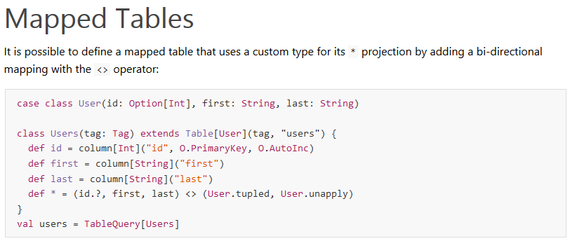

写了几年 asuna，前阵子心情好，全部悬而未决的坑都解决了，剩下一堆怎么做更好的坑。今天来水一下
asuna 的各种猥琐流招数。

先来一段 asnua 总纲（好了我要晒黑历史了，大家让一让）[黑历史](https://github.com/djx314/ubw/tree/333d49bb3f62f5c4c90e0da5201b65b452e060db)
所以当年不仅是  
  
这样的，甚至连我都不知道自己在做什么，搞懂自己在做什么是上两个星期的事情。以前只是自己有这个需求，
某些项目要用到一些这样的功能才一直做下来的。其中完全重构了上 6 次。

那 asuna 为什么叫做 asuna 呢？因为：
1. 必须可以像 asuna 那样，和 slick 天然搭配，引来人们羡慕的目光
1. 必须可以像 asnua 那样，身为劳动模范，无论在哪个哪个 framework
都有她的身影，闪耀着母性的光辉
1. 必须可以像 asuna 那样，遇到什么人就变成那个人的形状
1. 必须可以像 asuna 那样，可以同时变成几个人的形状
1. 必须可以像 asuna 那样，我编不下去了。。。

咳。。。那 asuna 可以做什么呢？这是我上上周才搞懂的问题。。。要回答这个问题需要两个场景：

### slick 场景
先来上一段 slick 代码
  
这个可以算是 slick 的经典 table 映射代码。现在这些代码都是使用 codegen
生成的了，年代久远一点的老司机（像我这种 1.x 跟到 3.x 的，算是看着 slick
走过来的了）应该知道，要用 slick，最烦的是这个 Table
声明，所有列都要声明情有可原，要数据库列名，要限制条件，要
primaryKey，这些都无法简单通过对象完全搞掂（quill
完全暴力用 macro 解决了，但充满了魔法）。尤其是 filter sortBy
这些操作，你不用宏魔法，在 scala 范围内，声明一个 column
是比较理智的做法。所以这叫函数式关系映射，因为真正工作的是函数，对象只是在操作的最后被装载。

但不知道诸位有没有一个大胆的想法，就是想把 Stefan 哔的那种。因为在 scala
2.10 年代，没有你喜欢的 case class，大表声明只能套几个 tuple，用几个嵌套
case class 凑合。2.11 年代，case class 好了，tuple 和 apply 这几个还没好。行，针对
case class 的解决方法有，复制一套 shapless 的 hlist 过来。一层
case class 就可以解决这个问题了。jilen 在知道这个好玩的东西之后，在我这里拿了例子，做出了
[slickext](https://github.com/jilen/slickext)，还被 slick
作者关注了，可见这个需求多么必要。
但问题是，slickext 只能帮你默认生成预设好的列，列名比较难确定，编辑器不友好，要是你没用
emacs 的话，可能要面对全屏 slick 代码都是红色的状态。
但手写 slick 的话，有个坑，列声明搞一次，def * 这个映射，同一个属性要写 3 次，所有
index（0，1，2这些索引号）还要写一次。因为要写 3
次的都是大表，多半 30 多个对象或者更变态，所以即使你 case class 一行过，但随时要面对一个 table
上百行的情况。而且类型安全。类型安全是什么意思呢？两层意思。

1. hlist 编译时间和列数的三次方成正比，起码耗费你 9 秒一个文件的编译时间。有一次用 codegen
生成了一整个一般规模的数据库（40 - 80 张表），因为一般设计大表其实挺多的，所以一次编译耗费时间
15 分钟。其实这也是一个文件一个表的 codegen 功能的设计初衷，因为多个文件可以并发编译，下个
release 就能用上了。不是一个文件全部表不好，而是实在是太浪费编译时间了。另一个侧面也说明了，大数据库用
codegen 和 slick，只能扔到一个依赖里面了，但数据库只要改变，谁都不好受，还有 CI
才是最大受害者。。。
1. hlist 的错误信息太玄学，基本无法阅读，所以没有人会选择阅读。这样就会引起一个问题，你只能逐个逐个地核对每一个
def 的顺序和另外三个相关提到的地方是不是一致，类型是否匹配。如果上 40 - 50
列的表你由错误到正确这条路，给自己的感觉就是，八百里开外，一枪打爆敌人狗头。  

所以这个映射是很美好，filter sortBy 用得爽，但如果不是后来你们有 codegen，我不敢想象在 quill
的引诱下还有多少人能剩下来。  

所以大家都知道，case class 的定义必不可省，table 的列定义也无可口非，但这个 def *
= xxx，诉我直言，我一早就对应好属性来写了，全世界都是对应好属性写的，不能省掉么。  
虽然后来有了 mapTo 用法，但是依然需要照顾顺序，只是到了在大
case class 的时候可以用回原始写法的程度。

好了，大家不要急，看完这个情景，再看看 shapeless 的场景，他是另外一个极端。

## shapeless 场景

shapless 的作用很明确，应用可以参考 circe。为一个 case class 的每个属性准备一个 type
class 或者说读写器，然后自行处理他们之间迭代和嵌套的关系，再加上 Lazy
的循环引用处理。基本可以在不需要反射的情况下完成一个对象的析构和构造。这是抽象类型和具体类型的一个沟通和桥梁。  

那 shapeless 有什么缺点呢？当然编译时间长上面已经提过了，确实是缺点之一。但这不是一票否决的问题。
只要性能没问题，等等还是能忍的，毕竟真要搞起来还可以全部 implicit
搞在一个子工程里。

#### 一票否决的问题在于某些对象需要特殊声明，而 shapless 很多时候只能通过 tagged type 等手段解决

怎么个说法？例如写一个 circe 的 generic，因为 circe 现有很多 encoder 和
decoder，你可以随便就撸一个 case class 到 JsonObject
的转换（实际上不是那么容易的，要考虑的问题太多，但要撸一个简单的难度不大）。现在问题来了，你的某一个属性需要特殊的处理。
例如，你的 age 属性是表单直接转 json 拿过来的，所以是个字符串，但你要的是一个 Int，dalao
们说不能用 BigDecimal 之类的类型（circe 的这个用法记得哦，BigDecimal
可以字符串智能转数字），于是你方了，赶忙加 tagged
type，对特定类型进行标记，然后对这个特定类型应用额外的处理方法。性能上没有问题，因为 tagged
type 对性能没影响。但有几个缺点。

1. 对每个特定类型应用 tagged
type，特殊需求的属性少的时候还好说，如果多起来又没有通一规律的话，怕不是几十个 implicit
满天飞。估计你想想就要。。。而这时候你又没有什么好的办法来解决这个问题。
1. 如果你只有几个属性要这样搞的话，还好，但 circe 不行。circe 和 tagged type
连用不行。  
（这里要膜一下 dalao，我认识的所有国人中，能在 0.4 以后的 circe 版本中用出 bug
的就只有他了，而且不止一个。写的 slick 插件被 slick 作者关注的就只有他和 tuminglei
了。写出目前还在维护中的 circe 插件并且被 circe 作者关注的也只有他了）  
所以这个问题突然就变成了无解的问题，只能用直接处理原始 json 这样的方案。circe
的确对这做了良好的支持，但只是对 circe 而言。

## asuna
观察了这两个场景，结合他们的一票否决条件，你会发觉，slick
的这种方式在声明特定属性的处理方式的时候很好用，但很多时候没必要每一列都声明，更没必要声明后再去一一对应
case class。shapeless 的 generice 很好用，但很多时候特定对象的处理并不太理想，有可能会用到 tagged
type 或者直接使用 hlist 的 api，在上几十列的 case class 生成的 hlist 中操作第 20
个对象，无异于八百里开外，一枪爆头。

那有没有一种从天而降的武功，emmm，那有没有一种两全的方法
1. 普通的属性通过 implicit 解决，除了建模外不需要额外声明
1. 特定属性只需要通过声明一个 table，只标记出需要特殊处理的那几列，其他列使用第 1 点提到的默认行为
1. 属性与属性之间自动对应，最好是通过属性名称对应
1. 编译速度快点

asuna 表示，同时满足 4 个人。。。咳，同时满足这 4 点就是我存在的理由了。  
那他有什么效果和还有没有其他好玩的地方呢？那肯定是有的，姿势实在是太多了，但你的时间有限，这里先展示几个（毕竟你不像我，你看我，一个人就可以提供足够的时间让 asuna 一次过展示所有的姿势）。

#### decoder 操作：slick 的函数式对象映射
由于 table 的列只是一个一个的函数，所以其实在读取数据转化成对象的时候用不用到他只是看
def * = 的心情。asuna 构造了一个函数式对象映射的容器，所以你可以声明一个原 case class
的子集，也就是说只有他一部分列的一个小 case class，建立一个和 table
的映射，即可直接根据宏帮你生成一个只用到 case class 那几列的
ShapeValue[Any, ModelType]，完全不需要侵入 slick api 或者改变 slick
的原本用法，就可以做到建立一个 case class 就生成一个缩减列的方案，做到十分方便的在
sql 的级别缩减列。

#### encoder 操作：slick 的灵活动态列
缩减列是数据库这个抽象到 case class 的 decode 操作，如果对这个 decode 操作做一个 encode
操作，说得有点绕。就是把这个 table 和另外一个 case class 的映射动态化，case class
只起到提供列名和参数的作用，就可以把列的集合 encode slick 上述的 decoder
中。说说效果大家可能会立刻明白，只声明一个 case class，那他所拥有的属性其实不会填入该 case
class，而是会变成一个 map，key 可能会跟 case class 的属性一样，但 case class
的属性更大程度上是限制了 key 的上限。而这个映射会在运行时根据传入的 List[String]
来判定究竟需要到哪几列，由于可以在编译时就获取到 circe 的 Encoder，所以很可能这个 map
会是一个 Map[String, Json]，从而根本不需要再去对输出进行太多额外的干预。并且完成这一系列操作根本不需要对
codegen 生成的这个 table 做改变。这个特性天然和 graphql 的输出方的需求相配合。

#### 其他 slick 操作
另外，因为内置了 list 的支持，所以你可以随意转换每一列的数据类型。也可以使用 match
case 和一些手段来类型安全地处理一些在运行时才能决定的数据库列。这几乎可以使你实现 bi
中一些简单的根据数据库获取到列信息再读取数据的情景。而且类型安全，无 sql
拼接，结合其他手段还可以动态 filter sortBy 和关联。

还有，其实 filter sortBy 只不过是一些 encode 操作，你可以使用 asnua 方便地实现限制了 key
范围的动态过滤和排序。优点是类型安全。如果你的限制字段设计得比较合理不会带来性能问题的话，
基本上没有手段施展魔法。因为所有传入的列信息参数只能是字符串，而字符串只能跟有限的字符串集合进行匹配，
而传入的过滤参数也经过了 circe 的 Encoder
过滤，而参数传入 slick 的时候也经由了 slick 自己 ast
的处理，这一切都是在编译期就处理好的，只能说在会不会怀孕方面，随便你带不带套，我已经吃药了，毕竟天天几十个片场。

#### 多重 encoder 操作：graphql 跨层操作
graphql 有时候数据库的模型和输出的模型是重合的。这时候完全可以使用同一个 case class，和
slick table 映射生成动态输出数据集，和 graphql 输出模型映射生成输出模型声明，table
一般为声明中需要到的特别列信息声明，例如某些列需要到一个 describe 这些。

上面说的是 case class 重用，那有没有 table 重用的需求呢？肯定有，就是上面，同时提供同一列的
filter 和 sortBy，那如果某一列只能提供 filter 怎么办？如果你还需要到这一列的 sortBy
的话，可以用到两个特性。一个将会实现，就是根据命名约定的重写机制，你可以根据一个命名的约定，
用另外一个特殊命名的属性覆盖现有属性，使得他可以有新的行为。另一个特性是列混合机制，
一个列可以声明两类功能，一般使用 def id = filterable.mixin(srotable).mixin(outable)，
这对于诸如 slick 的 table 这类每个普通列都可以同时提供几项会用到的功能，但某些列不具备这个
特殊行为的情况下，可以大大提升现有 table 的重用性，并且可以保持逻辑的清晰和易于适配各类情况。

#### 纵向多库同用（encoder 和 decoder 皆有）：play 的数据验证
普通的 json 提交分几个阶段，json 解析到对象，这一阶段任何不合法的数据都会造成一个 400
并且错误信息不可阅读。第二阶段是对数据进行验证，
例如用户名重复等问题多半会直接抛异常解决而不是返回一个友好的错误信息，
因为友好的错误信息需要逐层传递，如果一开始没有设计好只能根据异常去判断再转化这个信息。
使用 asuna 可以实现一个比较恰当的需求，
针对单列纵向使用多个判定，并且自定义返回数据的逻辑。

1. 例如提供各个类型的默认类型不匹配信息，在 circe decode
失败的时候单独对这一列应用这个错误信息，并且错误信息可以定制。
这就可以做到友好提示前端各种配型不匹配的问题。并且其他列依然进入下一步的判定，不会只在
circe decode 这一步就因为某一两列的问题返回单一步骤的失败信息。
1. 在 circe decode 成功之后我想判定 name 这个字段是否唯一，由于 asuna
的缘故，你可以只针对这个特定的列做判定，并且编写好详细的错误信息，
因为不会混合到你的业务代码中，所以你根本不会担心 Future 或者 Either
的多层套用造成的类型复杂问题。因为到了最后，你可能只是会把这所有的逻辑，加到一个 body parser
或者把 akka http 的几十层嵌套改为一层，你应该已经封装好错误信息的统一返回方法。Action
中你收到的 request.body 已经是经过千百重验证的可以直接插入数据库的 model 了。
1. 有可能会遇到需要两个属性同时验证的情况，目前还是计划通过命名规则解决。

#### table 作为 model
把 case class 作为 table 使用，构建 case class 到 case class
的映射，再加上可以声明特定属性和通过命名规则覆盖现有属性，基本就是一个 dto 了。

#### 装个逼
手贱前阵子实现了一个 circe 的 auto generic
1. 现有 encoder 优先
1. 暂时没有支持 option 和 seq
1. 通过 lazy 支持循环引用
1. 支持嵌套对象
1. 仅实现了 encoder
1. 可以临时改变某一个属性的 encode 行为

目前的状态是怎么样呢？一个 110 列的对象，asuna 可以达到 50% 到 60% 的性能，因为很多 circe
内部方法不能使用，所以再优化意义不大。但编译速度是 circe 的 4 - 5 倍。因为 asuna 是专门针对
case class 的，所以会跟 shapeless
的处理方法不同，他是把每一列分开用宏处理的，每一列的类型都对外屏蔽了。所以你会发现 asuna
的编译时间基本跟属性的数量成正比。

我踏马找 asuna 的本子睡觉去了。
